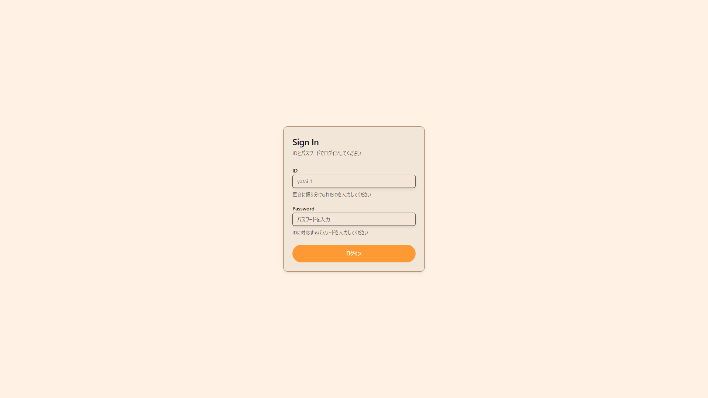

## 1. 情報を入力する

ID と Password に適切な値を入力してください。  
ID には、"@"以降は不要です。

> [!WARNING]
> アカウントは必ず 1 端末 1 つにしてください。つまり、 1 つのアカウントを複数端末で使用しないでください。

## 2. ログインボタンを押す

ログインボタンを押し、適切にログインできた際には、ホームページに戻ります。  
この際、画面右上に、ログインしたアカウントの ID が表示されるはずです。
