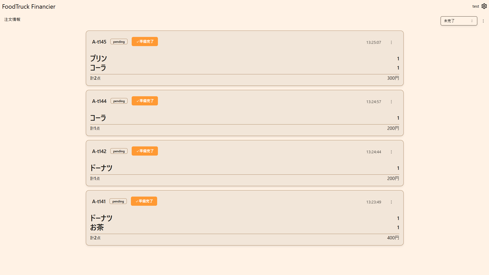
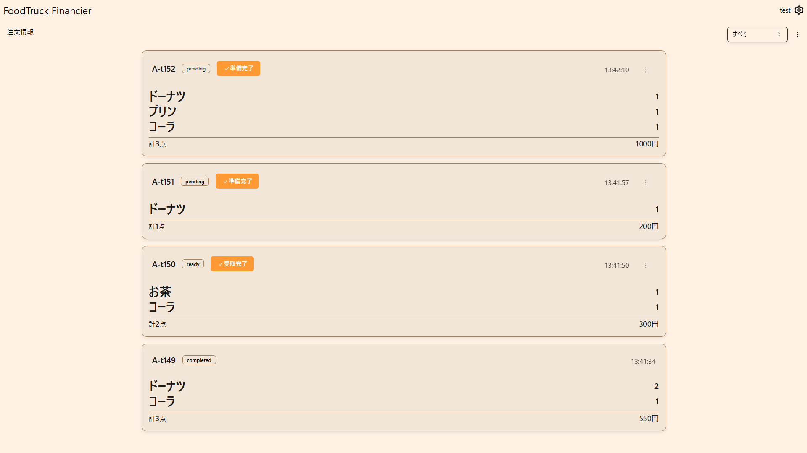

この画面は屋台で商品を準備する裏向けの画面となっています。

## 1.注文を確認して商品を準備する

商品名と、その右に書いてある個数を確認し、商品を準備してください。

## 2.商品の準備ができたら準備完了ボタンを押す

これによって受取管理画面(客に準備ができた番号を見せる画面)に番号が表示されます。

注文をキャンセルする場合は、時刻が書いてある部分の右の三点リーダーを押し、キャンセルボタンを押してください。キャンセルが押された場合は、注文は、受取管理画面には表示されず、また、在庫数は元に戻ります。

## すべての注文の確認

すべての注文を確認するには右上の未完了のところのドロップダウンメニューからすべてを選択することで表示できます。

