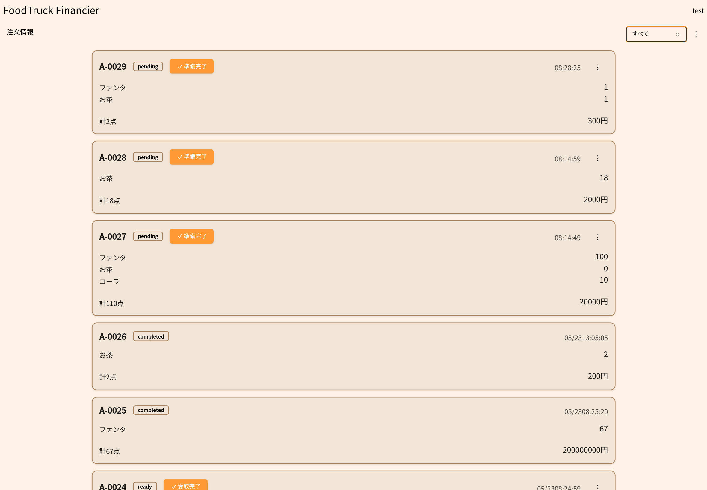

# 注文情報画面の使い方

この画面は屋台で商品を準備する裏向けの画面となっています。

## 1.注文を確認して商品を準備する

## 2.商品の準備ができたら準備完了ボタンを押す

これによって受取管理画面(客に準備ができた番号を見せる画面)に番号が表示されます

注文をキャンセルする場合は

## すべての注文の確認

すべての注文を確認するには右上の未完了のところのドロップダウンメニューからすべて
を選択することで表示できます。

