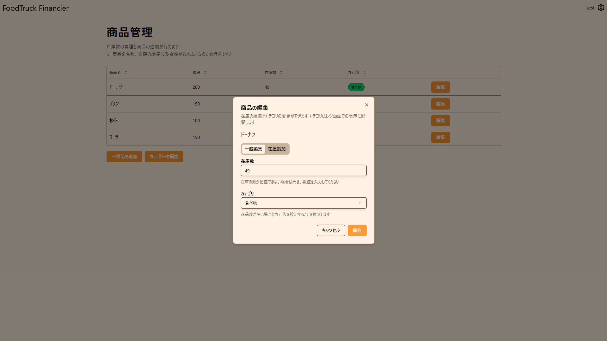
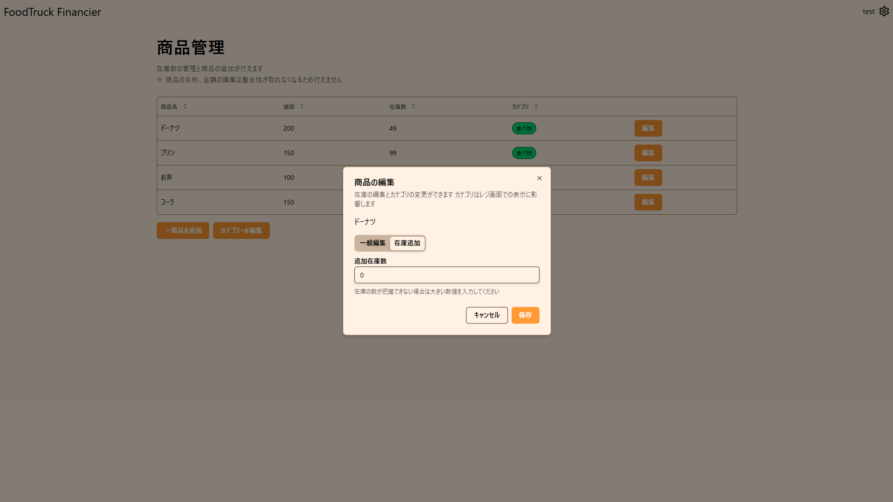
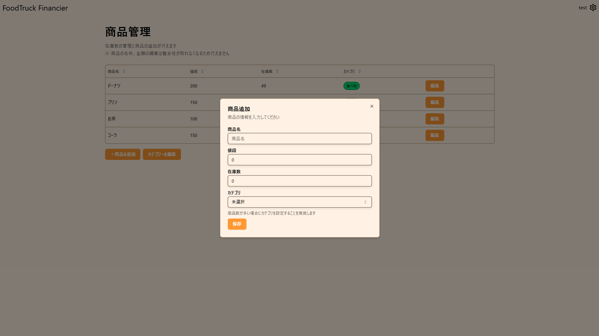
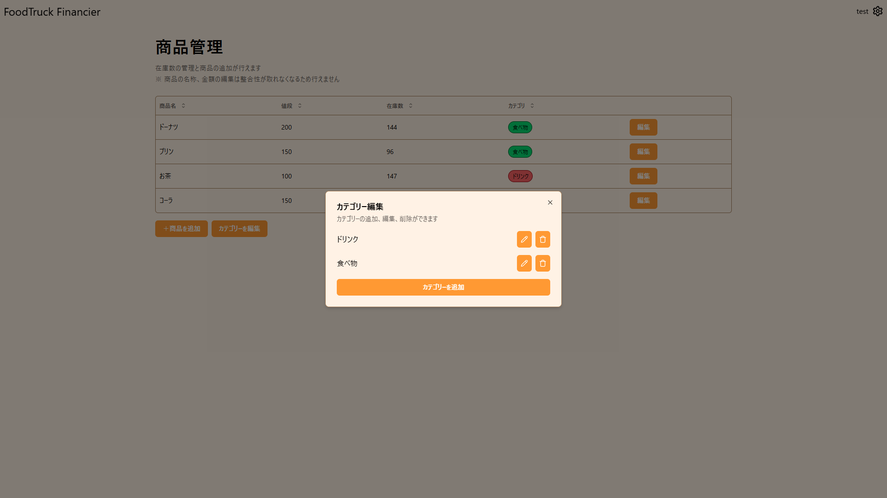
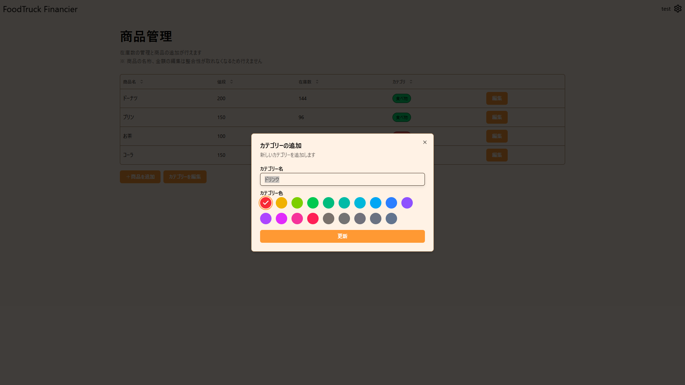

この画面では、商品の追加、在庫数の変更、カテゴリーの追加、編集等ができます。

## 商品の編集方法

在庫を追加したいという場合は、以下の「在庫の追加方法」を参照してください。

1. 編集したい商品の横にある編集ボタンを押す
   
2. 在庫数、カテゴリーを入力して完了ボタンを押す

### 在庫の追加方法

1. 追加したい商品の横にある編集ボタンを押す
   
2. 追加個数を入力して完了ボタンを押す

## 商品の追加方法

1. 商品を追加ボタンを押す 
2. 商品の情報を入力して完了ボタンを押す

## カテゴリーの追加方法

1. カテゴリーを編集ボタンを押す 
2. カテゴリーを追加ボタンを押す 
3. カテゴリー名、カテゴリー色(任意)を入力し、追加ボタンを押す

## カテゴリーの編集方法

1. カテゴリーを編集ボタンを押す 
2. 編集したいカテゴリーの右にあるペンボタンを押す
   
3. カテゴリー名、カテゴリー色を変更し、更新ボタンを押す

## カテゴリーの削除方法

1. カテゴリーを編集ボタンを押す 
2. 削除したいカテゴリーの右にあるゴミ箱ボタンを押す

## 商品名、値段の変更方法

商品名、値段については集計システム上編集できなくなっています。そのため以下の方法を使用してください。

1. 編集する商品の在庫を 0 にする
2. 新しく商品を追加する。このときに名前を元のものと変えておくとわかりやすいです。

## 商品を削除する

商品の削除は集計システム上できません。代わりに、在庫数を 0 にしてください。
