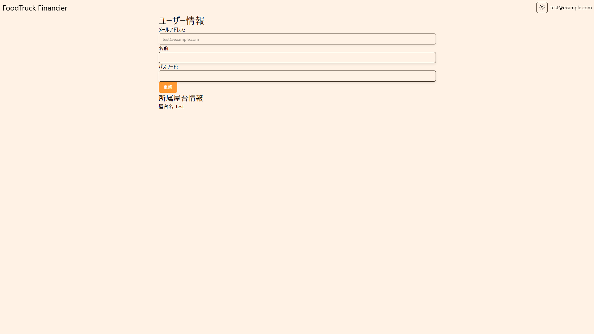

> [!WARNING]
> アカウントは必ず 1 端末 1 つにしてください。つまり、 1 つのアカウントを複数端末で使用しないでください。

## ユーザー情報ページ

ユーザーのメールアドレス → ユーザー情報からユーザー情報を確認できます。

- メールアドレス:登録されているメールアドレスです
- 名前:登録されている名前です
- 所属屋台情報:所属している屋台の名前です。万が一間違っている場合は管理者へお問い合わせください
